# September 26: Researching ideas

The goal of this project was to build a cheap head-mounted camera that I can use for recording lapse timelines when I am building my projects. I couldn't find a solution for this, and existing head-mounted recorders are expensive and can't record live to Lapse.

I wanted to do some research on how to make a TPU strap, so I went on MakerWorld looking for straps I can use. I needed it to adapt to my head and be adjustable for different heads. I opened Fusion and started brainstorming.

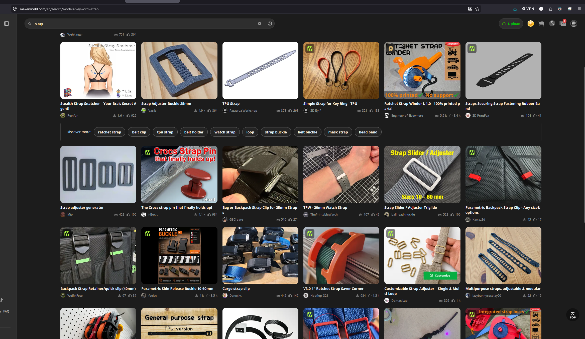

I did not feel like measuring my head (I didn't have a flexible measuring tape nearby), so I just asked ChatGPT what the circumference around the forehead area of a normal adult head is.

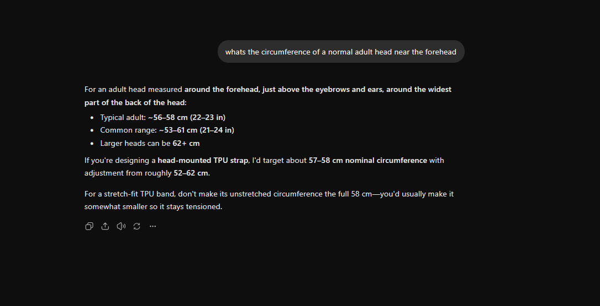

So based on what ChatGPT said, I was going to add some headroom and make my TPU strap able to connect in those positions.

Now I am going to research what camera to use. I found it. This $4 camera is cheap on AliExpress.

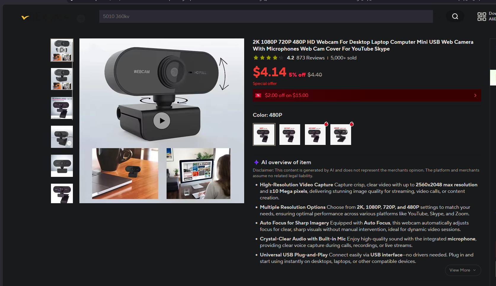

I needed to get the camera and its measurements, so I will buy it and wait for it to arrive.

Also, I will buy this USB extender so I can actually move while recording.

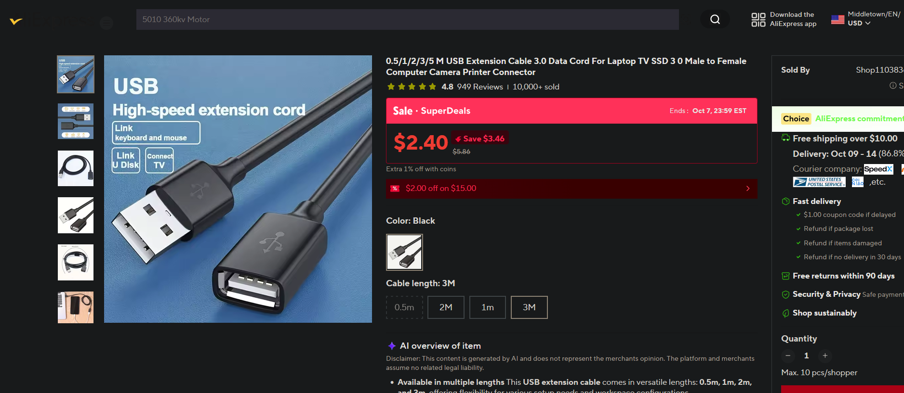

**Total time spent: 15 minutes**

# October 3: Cadding the strap

I took measurements of the camera and also dried my TPU, then put it into my printer.

Here are the lapse recordings for my CAD:

- [Lapse 1](https://lapse.hackclub.com/timelapse/CsxrR57OEFcb)
- [Lapse 2](https://lapse.hackclub.com/timelapse/rOGjy3luxVwS)

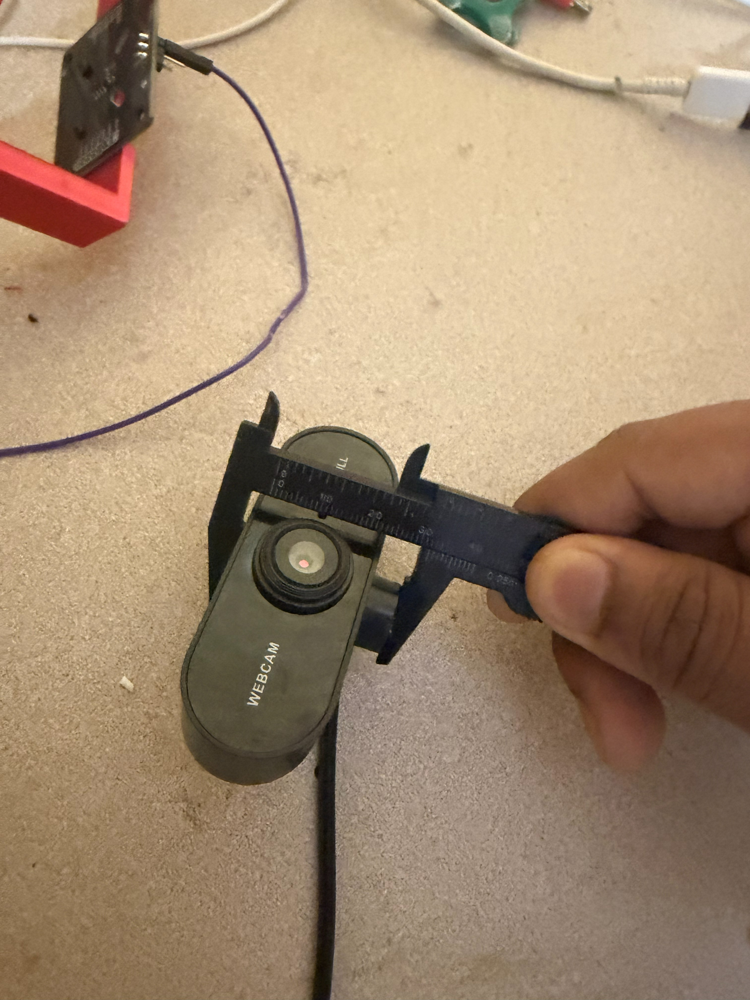

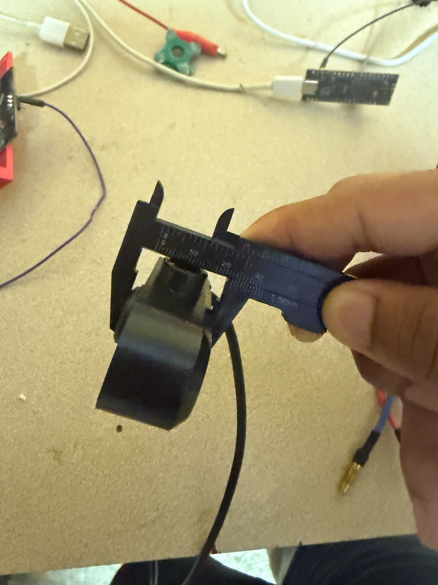

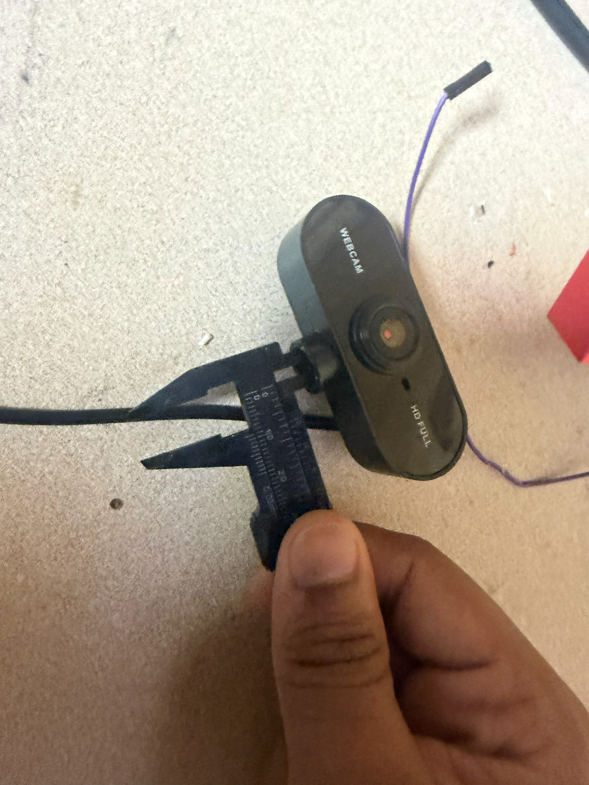

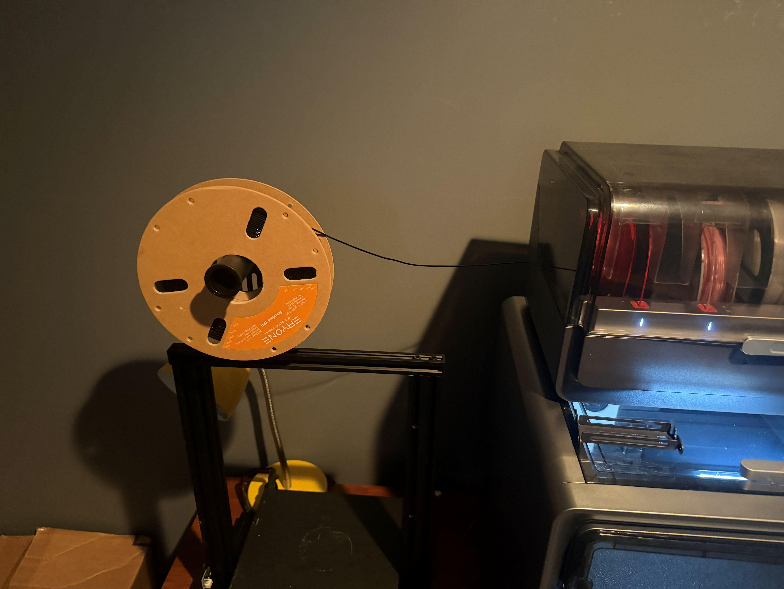

I had CADded a strap for my camera. For a quick test, I cut some pieces and printed them to see how they fit and check the tolerances.

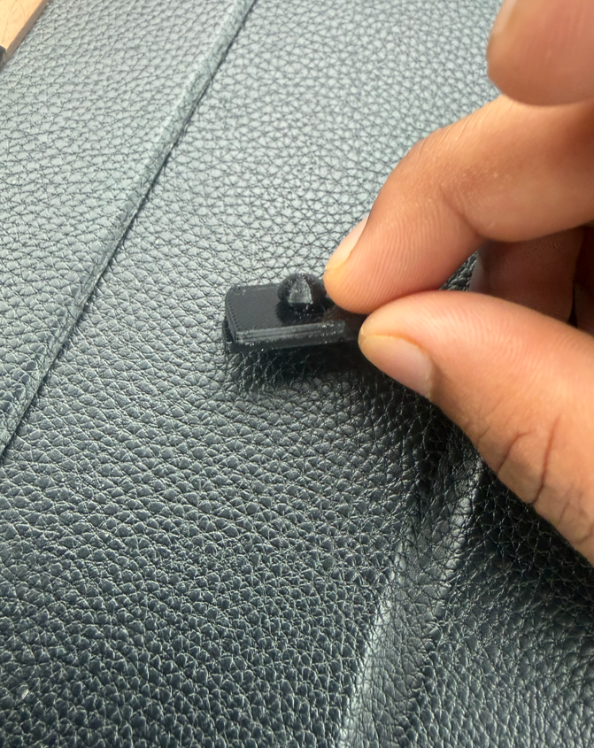

I noticed that it was a little loose, so I went into CAD and fixed it (Lapse #2).

I will see tomorrow morning and see how it works.

**Total time spent: 2 hours**

# October 3: Building the camera and testing it

So I glued the attachment pieces together, and I actually used a soldering iron on top of the glue because I think the iron might actually be better as it joins the structure together.

So I had left it to print overnight. It was roughly 56 grams, made fully out of TPU with 100% infill.

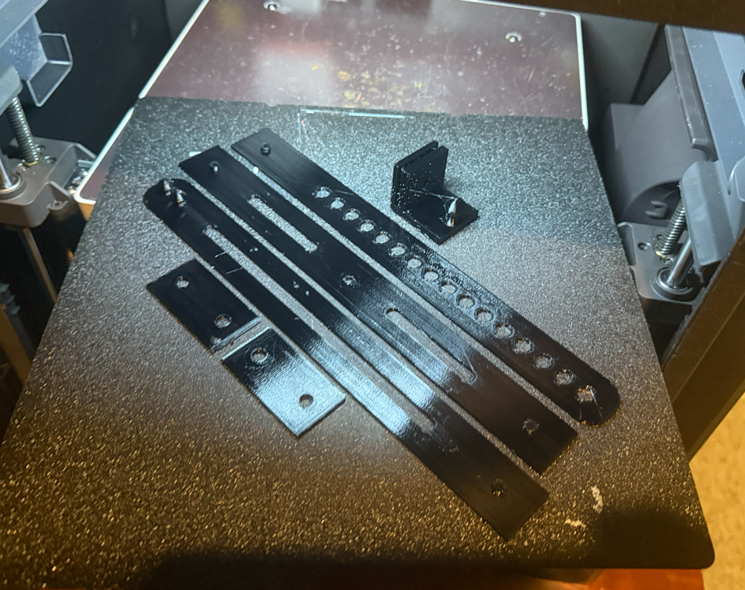

I used super glue and a soldering iron, and it actually looked pretty good and joined together.

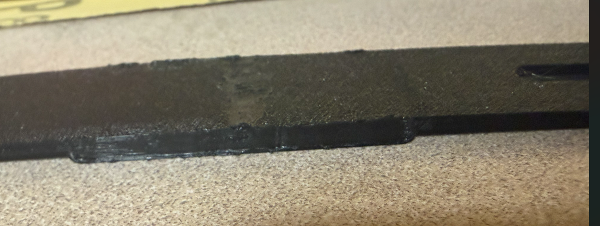

These are the final results. I have also included a demo video.

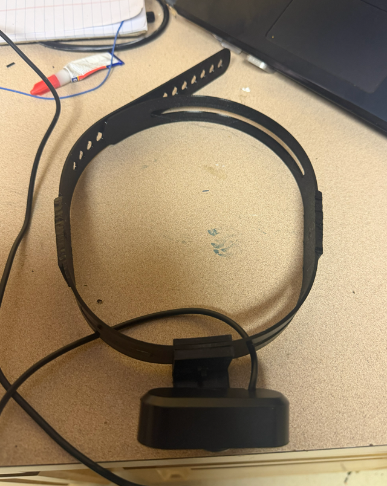

That's the final strap with the camera put on its ball pivot. The ball pivot fits nice and tight.

Here is the video of me using the final thing. One thing I noticed was that the camera FOV is so low, but it is a benefit since I can use my computer privately without the camera being able to see what I am doing, which adds privacy. Anyways, I will probably upgrade to a higher FOV, probably a fisheye camera.

Here is a demo video of me using it on my head with Lapse:

[my demo video](assets/journal-entry-003/my-demo-video.mp4)

## Extra on head pics

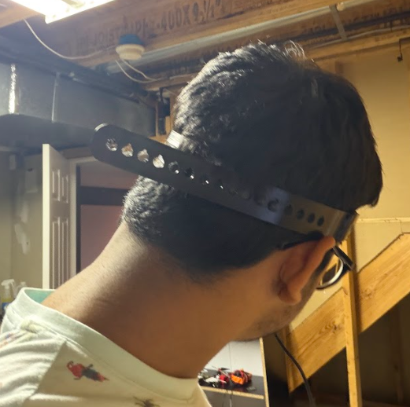

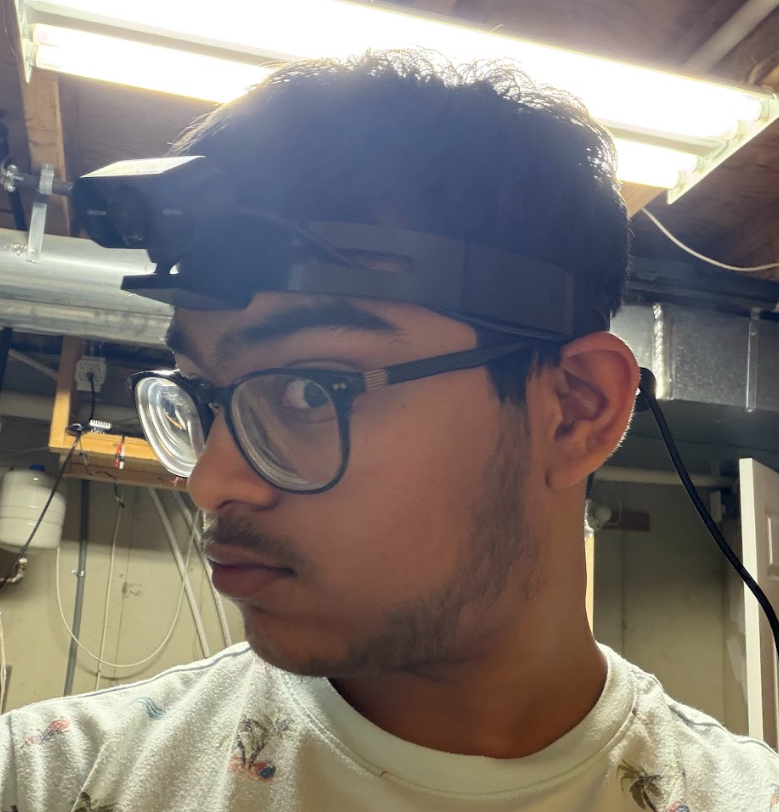

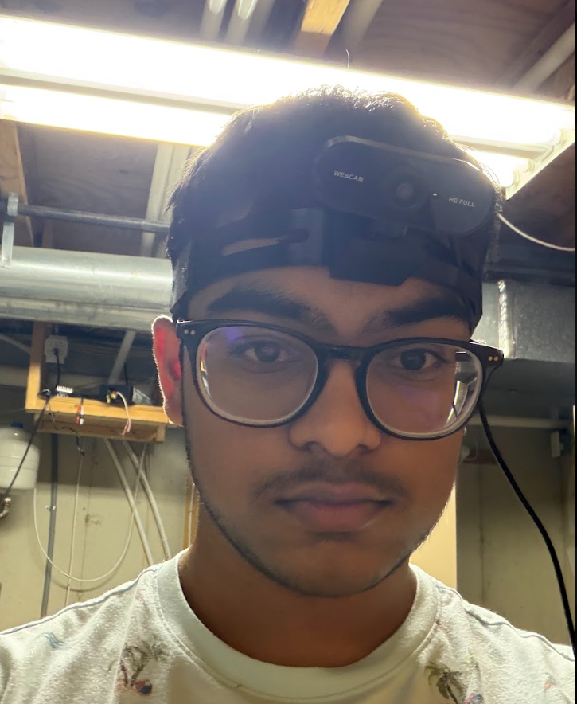

**Total time spent: 20 minutes**
