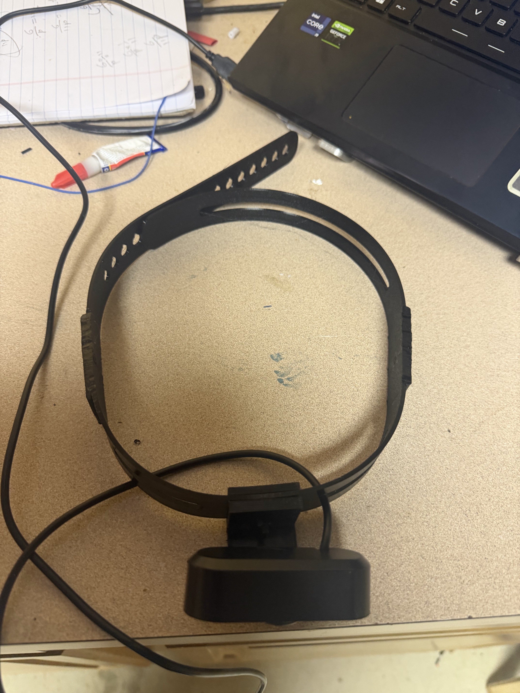

# Head mounted camera for Lapse recordings

This is a cheap head-mounted camera I built using a cheap USB camera and a TPU-printed strap. It was designed by me so that I can record Lapse while working from a first-person view.

## What I would do differently next time

Definitely get a higher FOV camera; this one can barely see what I’m doing.

## Picture of the device

## Bill of materials

| Part | Description | Cost |
| --- | --- | ---: |
| Part 1: Camera | [USB camera from AliExpress](https://a.aliexpress.com/_m0Khjwj) — listed at $4.14 | $4.14 |
| Part 2: TPU strap | 56 g of TPU, prorated from a [1 kg Creality TPU spool on Amazon](https://www.amazon.com/dp/B0C2Z1LJGM) | $1.21 |
| Optional: USB extender | [USB extension cable from AliExpress](https://a.aliexpress.com/_ms0uDrl) | $1.09 |
| **Total without optional extender** | Camera + TPU | **$5.35** |
| **Total with optional extender** | Camera + TPU + USB extender | **$6.44** |

The TPU cost is calculated as 56 g out of a 1,000 g spool. The camera price is from the listing screenshot when I found it; prices may change. Shipping and tax are not included.

Progress is documented in the [build journal](JOURNAL.md).
