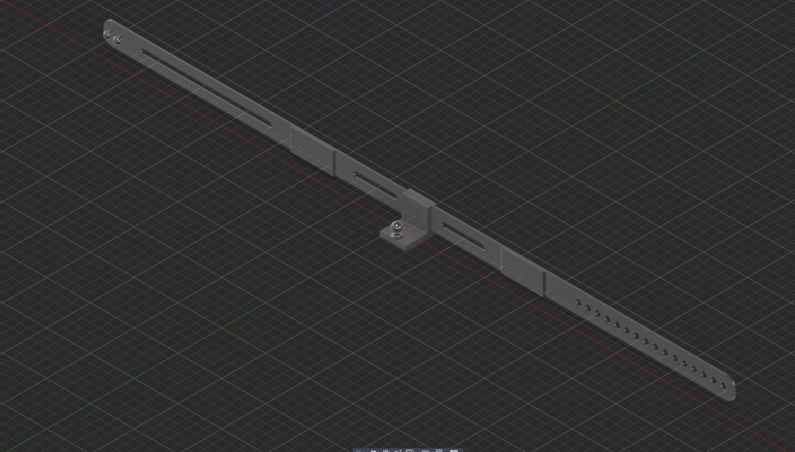
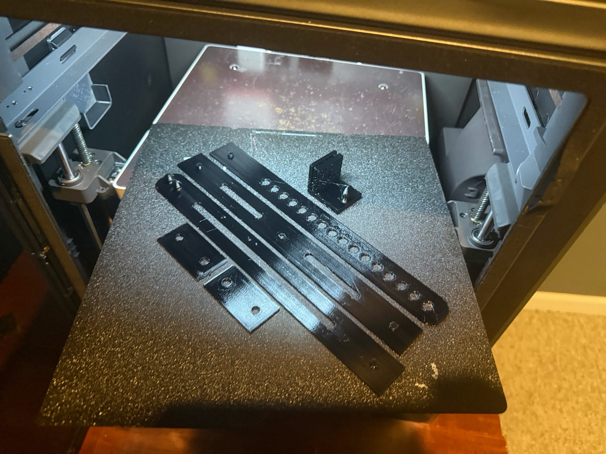
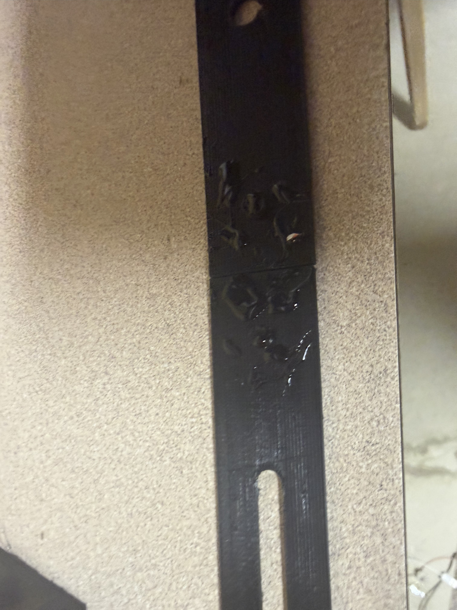
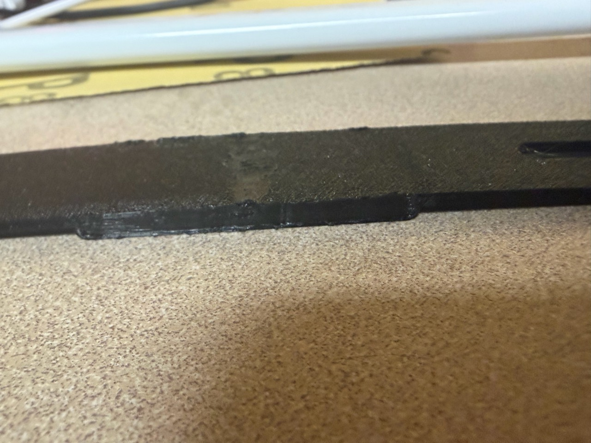
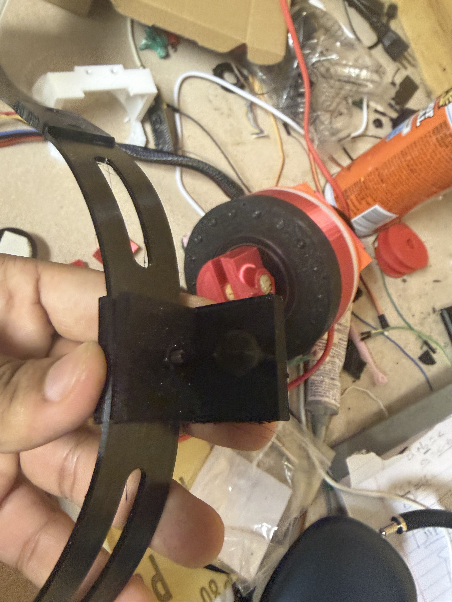
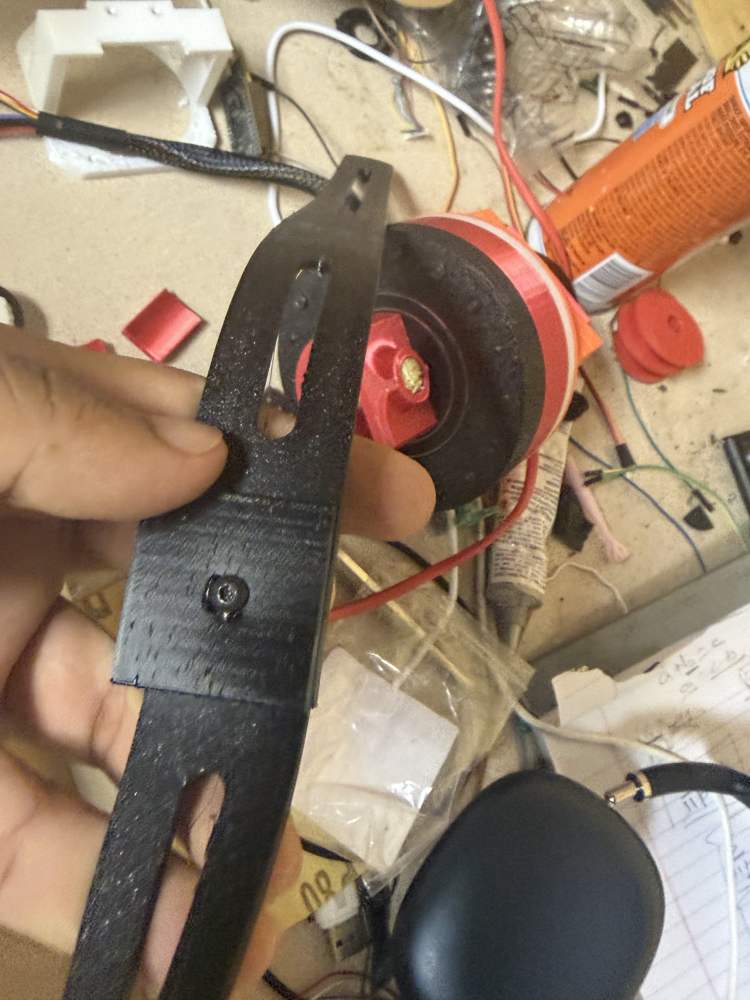

# Head mounted camera for Lapse recordings

This is a cheap head-mounted camera I built using a cheap USB camera and a TPU-printed strap. It was designed by me so that I can record Lapse while working from a first-person view.

## What I would do differently next time

Definitely get a higher FOV camera; this one can barely see what I’m doing.

## Picture of the device

## Fully assembled CAD

## Demo video

[Watch the demo video](https://youtu.be/GmYpVjxm2xM)

## Bill of materials

| Item | Cost |
| --- | ---: |
| [USB camera](https://a.aliexpress.com/_m0Khjwj) | $4.14 |
| [TPU filament](https://www.amazon.com/dp/B0C2Z1LJGM), 56 g | $1.21 |
| [USB extender (optional, included in total)](https://a.aliexpress.com/_ms0uDrl) | $1.09 |
| [M3 button-head screw, 10 mm, and nut](https://www.amazon.com/dp/B0DFWYBJJJ) | $0.02 |
| [Super glue](https://www.amazon.com/dp/B00KPYB05A), 2 mL | $0.66 |
| **Total, including USB extender** | **$7.12** |

See the [BOM CSV](BOM.csv).

## Assembly instructions

1. First, print all the parts in the [printable STL files in the CAD folder](CAD/Individual%20STL%20files).

   

2. Next, get the three 240 mm strap pieces. Align them according to the CAD. Put the Adapter 240 mm piece in the center, the strap with holes on the right, and the mushroom strap on the left. The extruded circles should face each other.

3. Apply glue to the aligned pieces.

   

4. Put the strap joiners on, making sure they mesh with the extruded circles.

5. To further secure the attachment, use a soldering iron to melt the plastic pieces together.

   

6. Use an M3 button-head screw that is 10 mm long and a nut to secure the camera adapter to the strap.

   

   

7. Put the camera on the ball pivot. You can attach a USB extender for more range if you have one. Connect it to your computer to record.
